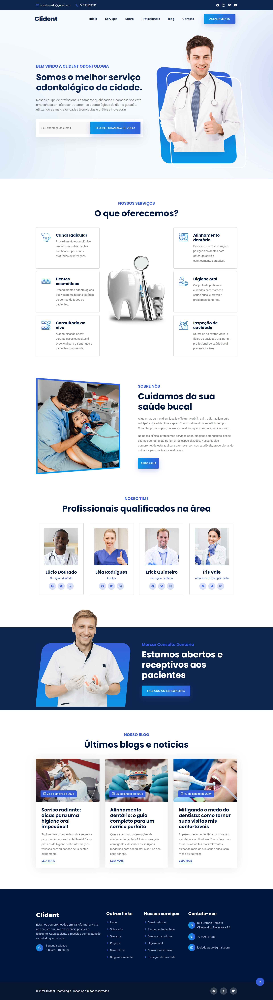

<b>Projeto <a href="https://clidentodontologia.netlify.app/">Clident Odontologia</a> - Freelancer</b>

O projeto Clident Odontologia é um site online desenvolvido para a clínica local como freelancer, utilizando HTML5, CSS3 e JavaScript. Ele proporciona uma experiência completa e interativa. Com um design moderno e funcionalidades inovadoras, o site é adaptável para todos os dispositivos.

 

👨🏼‍💻 <b>Tecnologias utilizadas:</b>

&nbsp;
&nbsp;
&nbsp;

🛠️ <b>Recursos e funcionalidades:</b>

- Informações detalhadas sobre serviços odontológicos oferecidos.
- Agendamento online para maior conveniência dos pacientes.
- Galeria de imagens destacando as instalações e equipe profissional.  

🔒 <b>Licença</b>

Este projeto está sob [LICENSE](LICENSE), o que significa que você não tem permissão para usar, modificar e distribuir o código conforme desejar, desde que mantenha o aviso de direitos autorais e a licença. Contudo, se você encontrar bugs, tiver sugestões de melhorias ou quiser contribuir de alguma forma, ficarei feliz em receber seu feedback.

✉️ <b>Contato:</b>

Se você tiver alguma dúvida, sugestão ou interesse em colaborar, não hesite em me contatar.

Email: <a href="mailto:danielportela.ti@gmail.com">danielportela.ti@gmail.com</a>
